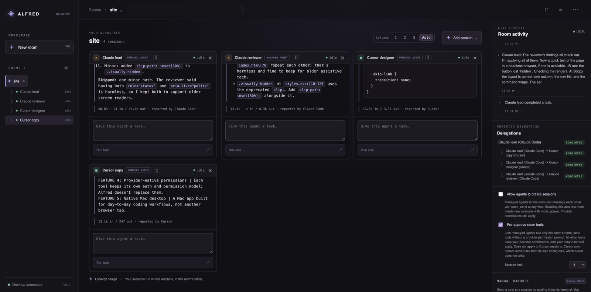
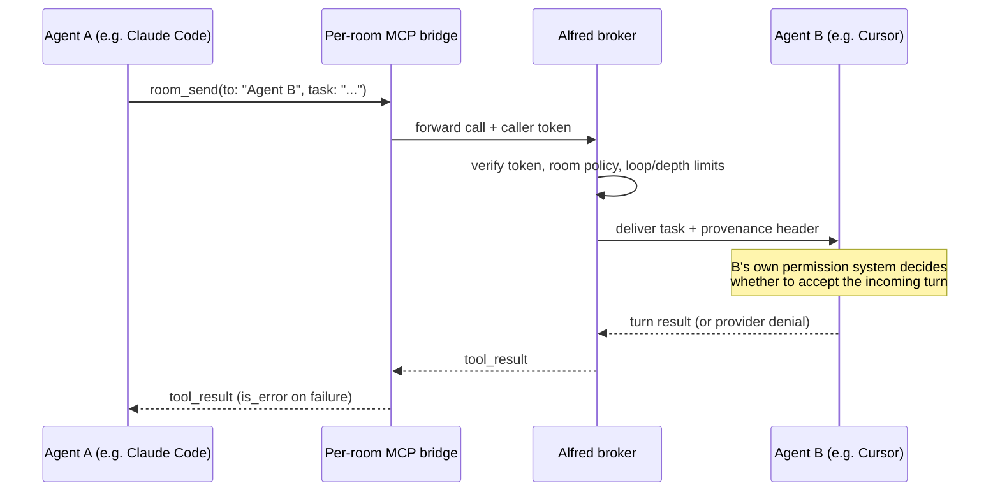
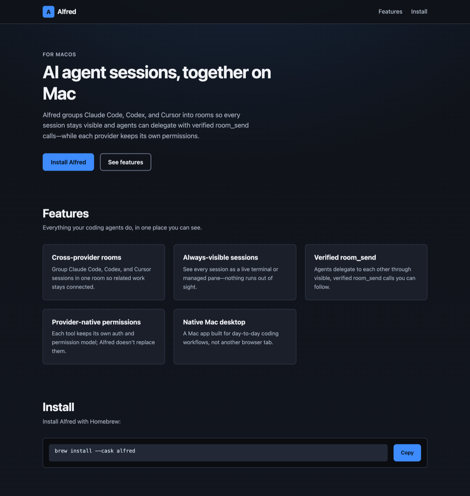
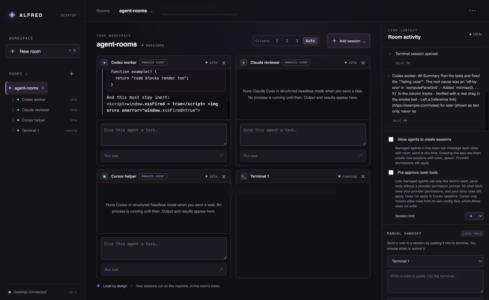
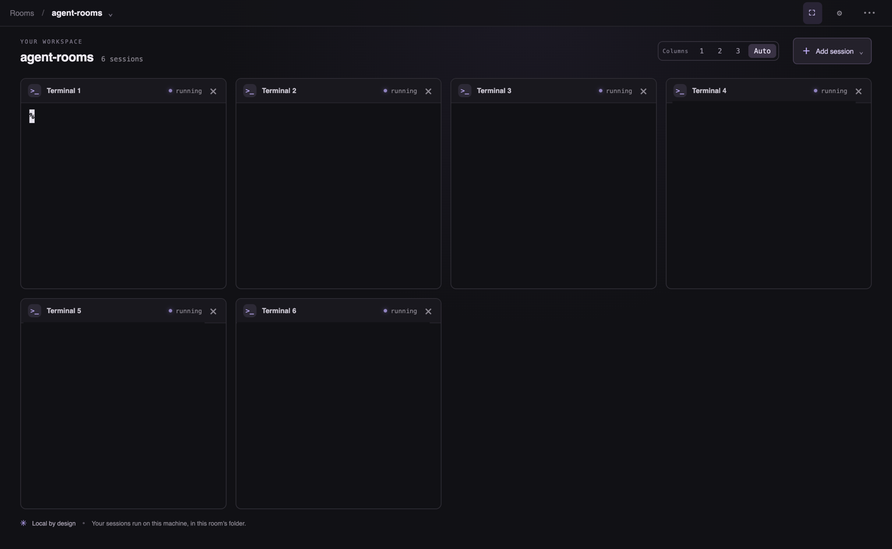
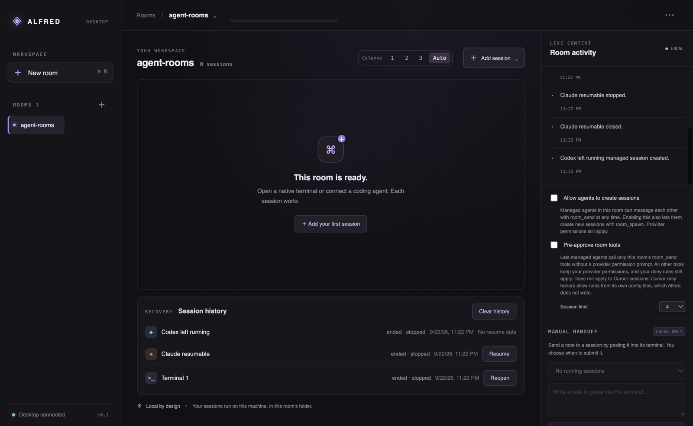
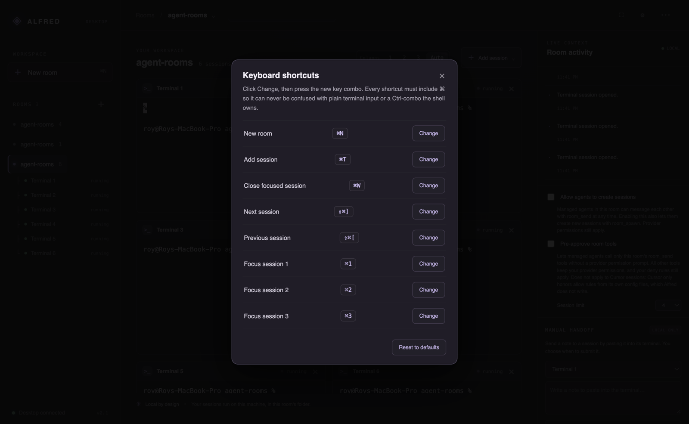

<p align="center">
  
</p>

<h1 align="center">Alfred</h1>
<p align="center"><strong>Every one of your coding agents, in one room, on your machine.</strong></p>

<p align="center">
  <a href="LICENSE"></a>
  
  <a href="https://github.com/roybs2/alfred/releases"></a>
  <a href="https://github.com/roybs2/alfred/stargazers"></a>
</p>

<p align="center">
  <a href="#install">Install</a> ·
  <a href="#quickstart">Quickstart</a> ·
  <a href="#how-agents-talk">How agents talk</a> ·
  <a href="#provider-support">Provider support</a> ·
  <a href="#faq">FAQ</a>
</p>

<p align="center">
  
</p>

Alfred is a Mac desktop app for people who run more than one coding agent at once. It doesn't
replace Claude Code, Codex, or Cursor — it gives their CLIs a home: real terminals and headless
"managed agent" sessions, organized into **rooms**, with an explicit, auditable way for agents to
hand work to each other over a local MCP bridge.

Like the man himself: always in the room, never in the way.

## Why

If you already run two or three coding-agent CLIs on a real project, you know the drill: a wall of
terminal tabs you can't tell apart, copy-pasting a prompt from one agent's output into another
agent's input, and no record of what you handed off or when. Alfred organizes those sessions
visually, and — where a provider actually supports it — lets an agent hand a task to another agent
directly, with the exact task text and provenance shown in plain sight.

Alfred adds no orchestration model of its own. It never decides what an agent should do, never
rewrites the context it forwards, and never adds a permission-bypass flag to launch a CLI faster.
Every delegation is either something you typed, or something a real provider tool call did — and
either way, it shows up in Room Activity.

## Features

- **Rooms.** One room per project; vertical, grouped session tabs so you can scan and switch fast.
- **Native terminals and managed agents, side by side.** Launch a plain shell, or a managed Claude
  Code / Codex / Cursor session that runs headless with that CLI's own login and permissions —
  never Alfred's.
- **Split panes, resizable columns, focus mode.** Tile 1–3+ columns (or `Auto`), drag column widths,
  or hit ⌘⇧F to hide the sidebar and Room Activity panel and just work.
- **`room_send` / `room_spawn` delegation.** An agent can message another session in the room, or
  start a new one, through a per-room MCP bridge — never a routing LLM, never a rewritten prompt.
- **A verified Delegations tree.** Room Activity shows exactly who delegated to whom and whether it
  completed, right next to the raw lifecycle events — not a guess, a parsed provider event.
- **Permission-denial visibility.** If a provider's own permission system blocks a room tool call,
  that shows up as a labeled warning in the room — Alfred never bypasses it to make the call succeed.
- **Opt-in room policies.** "Allow agents to create sessions" and "Pre-approve room tools" are both
  off by default, scoped to this room's bridge only, and logged when changed. Pre-approval only ever
  allows the room's own `room_send`/`room_spawn` tool names — it does not touch any other permission.
- **Provider usage, where reported.** Claude's cost/token usage, Codex's token usage, and Cursor's
  token usage are shown on `task-completed` when the provider actually reports them — never estimated.
- **Recovery after restart.** Ended sessions and their short activity labels persist per room, so you
  can **Resume** a managed agent (via the provider's own session/thread id) or **Reopen** a terminal
  after quitting — never with a restored transcript, since none is stored.
- **Configurable keyboard shortcuts.** Every action is rebindable in Settings (⌘,); every combo must
  include ⌘ so it can never collide with plain terminal input or a shell's own Ctrl-combo.
- **Manual handoff.** Paste a reviewed prompt into another session's terminal without it being
  submitted automatically — Alfred never presses Enter for you.
- **Local by design.** Everything runs as your own local processes, under your own logins. No
  hosted runtime, no team service, no telemetry.
- **No transcripts stored.** Alfred persists room names, session metadata, and short lifecycle
  labels — never terminal output, agent transcripts, or task text.

## Install

Download the latest `.dmg` from [Releases](https://github.com/roybs2/alfred/releases) — separate
builds for Apple Silicon (`arm64`) and Intel (`x64`).

**Requirements:** macOS, and — for any provider you want to use as a managed agent — that
provider's CLI installed and already signed in with your own account:

- [Claude Code](https://code.claude.com/docs/en/overview)
- [Codex CLI](https://developers.openai.com/codex/cli)
- [Cursor CLI](https://cursor.com/docs/cli) (`cursor-agent`)

You don't need any of them installed to use Alfred as a terminal organizer — plain shell sessions
always work.

### Gatekeeper (the build is unsigned)

Alfred ships as an **unsigned** app — no Apple Developer ID, no notarization. macOS will refuse a
plain double-click the first time, usually with *"Alfred can't be opened because Apple cannot check
it for malicious software"* (or the more alarming *"...is damaged and can't be opened"*, which
really just means unsigned/quarantined). To open it:

1. **Right-click (Control-click) `Alfred.app` → Open**, then click **Open** in the dialog. Only
   needed once per machine.
2. If there's no "Open" button there, go to **System Settings → Privacy & Security**, scroll down,
   and click **Open Anyway** next to Alfred, then confirm.
3. Or, from the terminal, remove the quarantine attribute directly (only for a build you trust the
   source of):
   ```sh
   xattr -dr com.apple.quarantine /Applications/Alfred.app
   ```

See [doc/release.md](doc/release.md) for the full packaging writeup, including what's been tested
against the actual packaged app.

## Quickstart

1. **Open Alfred** and click **New room**, then pick your project's folder.
2. **Add a session** — a plain terminal, or a managed Claude Code / Codex / Cursor agent (only
   CLIs Alfred actually detected on your machine are offered).
3. **Give it a task** in the composer, or just work in the terminal like you normally would.
4. To let agents in this room message each other, turn on **Allow agents to create sessions**
   and/or **Pre-approve room tools** in the room policy panel — both are off until you opt in.
5. Watch **Room Activity** on the right: session lifecycle, delegations, and any permission
   denials all show up there, live.

## How agents talk

There's no router model deciding who talks to whom. `room_send` and `room_spawn` are two MCP tools
exposed only to the agents in *this* room, by a small local bridge process Alfred starts per
session. A provider's own agent calls the tool like any other tool it has — Alfred's broker checks
the caller's token, the room's policy, and loop/depth limits, then delivers the exact task text and
provenance to the target session and waits for its result.



The delivered task always carries a fixed provenance header (which room agent sent it, and a task
id) plus one fixed line telling the receiving agent to reply as its final answer — never a rewritten
or summarized version of what was sent. Every hop is visible in Room Activity: `delegation`,
`task-started`, `task-completed`/`task-failed`, and `permission-denied` when a provider's own
permission system blocks the call.

One nuance worth knowing: Claude Code runs non-read-only MCP tools one at a time within a turn, so
if a Claude agent calls `room_send` twice in the same turn, the second delegation only starts after
the first one's result comes back — it's sequential, not fan-out, even though Alfred's own broker
can handle concurrent calls. See [doc/tasks.md](doc/tasks.md) for the live evidence.

## Keyboard shortcuts

All rebindable in **Settings** (⌘, or the header gear icon). Defaults:

| Action | Shortcut |
| --- | --- |
| New room | ⌘N |
| Add session | ⌘T |
| Close focused session | ⌘W |
| Next / previous session | ⇧⌘] / ⇧⌘[ |
| Focus session 1–9 | ⌘1 – ⌘9 |
| Next / previous room | ⌘⌥↓ / ⌘⌥↑ |
| Toggle focus mode | ⇧⌘F |
| Toggle Room Activity panel | ⇧⌘A |
| Open settings | ⌘, |
| Focus task input | ⌘L |

Every shortcut must include ⌘, so it can never collide with plain terminal input or a shell's own
Ctrl-combo — and while a terminal has focus, only ⌘-combos are intercepted at all. A small reserved
set (⌘C/⌘V/⌘A/⌘Z/⇧⌘Z/⌘Q/⌘H/⌘M) can never be rebound or swallowed anywhere.

## Security & privacy model

- **Local only.** Every session is a local process under your own user account. There's no hosted
  runtime, no Alfred-operated server, and no team/cloud account.
- **Your CLIs, your logins, your permissions.** Alfred launches the provider CLI you already
  installed and signed into. It never adds a permission-bypass, `--yolo`, `--force`, `--trust`, or
  API-key-auth flag on your behalf.
- **Opt-in room policy, narrowly scoped.** "Pre-approve room tools" only ever allows the exact
  `room_send`/`room_spawn` tool names for *this room's own bridge process* — never a wildcard, never
  any other tool, and it's shown and logged whenever it changes.
- **No transcripts, no credentials, in project metadata.** Alfred persists room names, session
  metadata, and short lifecycle/delegation labels (e.g. "Codex child completed a task.") — never
  terminal output, agent transcripts, task text, or credentials. A resumed managed session carries
  only the provider's own opaque session/thread id, which is not a credential.
- **Narrow, validated IPC.** The renderer is isolated from Node; native actions (spawning a PTY,
  reading a directory) pass through a small validated preload bridge, not raw Node APIs.

## Provider support

| Provider | Native terminal (PTY) | Managed (headless) agent | As a `room_send`/`room_spawn` target | As a `room_send` caller |
| --- | --- | --- | --- | --- |
| **Claude Code** | ✅ | ✅ Verified live: init/session id/resume, bridge status, permission-denial behavior under default mode. Pre-approval flags are unit-tested; not yet confirmed live | ✅ Verified live — Claude lead → Claude reviewer completed in the final end-to-end run | ✅ Verified live, including a full Claude→Cursor `room_send` |
| **Cursor CLI** (`cursor-agent`) | ✅ | ✅ Verified live: session id/resume, workspace-trust handling, denial events | ✅ Verified live — Claude→Cursor `room_send` completed end to end, and Cursor designer/Cursor copy both completed again as targets in the final end-to-end run | ⚠️ Denied by Cursor's own default permission mode in every test run; Alfred's pre-approval flags don't apply to Cursor (it only honors its own `Mcp(server:tool)` allow rules, which Alfred never writes). An allowed Cursor-initiated call is **not yet verified**. |
| **Codex CLI** | ✅ | ✅ Verified live (0.156.1): full turn, `codex exec resume` on the same thread, bridge startup/JSONL parsing, cancellation | ✅ Verified live — a Claude→Codex `room_send` completed end to end | ✅ Verified live — Codex's own approval policy denies its `room_send` call by default (clear error, turn still completes); the room's "Pre-approve room tools" option suppresses that denial and a Codex→Claude `room_send` completes end to end |

Nothing here is inferred from "the CLI launches" — see [doc/adapters.md](doc/adapters.md) for the
full capability contract and [doc/native-integration.md](doc/native-integration.md) for exact flags
and event shapes per provider, with dates and CLI versions. Alfred never claims a capability a
provider hasn't actually demonstrated in a real run.

## Built with Alfred

The screenshot above is from a real run: 2 Claude Code and 2 Cursor managed agents, in one room,
building a one-page site together — no human wrote any of the HTML/CSS/JS. Claude lead typed the
brief, then delegated with three `room_send` calls (Cursor copy for the hero/feature text, Cursor
designer for the CSS, Claude reviewer for an accessibility/bug pass) before integrating everything
itself. Total time was about 4 minutes; total reported cost was $1.14 of Claude usage (2 tasks) plus
Cursor's own reported token usage (no cost field). It's a demo run, not a benchmark — see
["Final end-to-end test 2026-09-22"](doc/adapters.md#final-end-to-end-test-2026-09-22) in
doc/adapters.md for the full blow-by-blow, including the permission findings and bugs it turned up.

<p align="center">
  
  <br><sub>The generated demo page — the <code>brew install --cask alfred</code> command it shows is text the agents wrote for a fictional page, not a real install method; install Alfred from <a href="https://github.com/roybs2/alfred/releases">GitHub Releases</a> above.</sub>
</p>

## Screenshots

<p align="center">
  
  <br><sub>Codex, Claude, and Cursor in one room, plus a plain terminal — with safe Markdown rendering</sub>
</p>
<p align="center">
  
  <br><sub>Focus mode (⇧⌘F): six sessions launched at once via Add multiple, tiled and distraction-free</sub>
</p>
<p align="center">
  
  <br><sub>Recovery after restart: Resume a managed agent by its provider session id, or Reopen a terminal — never a restored transcript</sub>
</p>
<p align="center">
  
  <br><sub>Every shortcut is rebindable, and every combo must include ⌘</sub>
</p>

## Build from source

```sh
npm install          # also rebuilds node-pty for the installed Electron ABI
npm run dev           # interactive development app
npm test              # isolated backend tests
npm run test:smoke    # real Electron + a real local shell (isolated temp state;
                       # never launches billable agent work)
npm run dist:mac      # unsigned arm64 + x64 dmg/zip via electron-builder
```

See [AGENTS.md](AGENTS.md) and [doc/README.md](doc/README.md) for the fuller project doc index
(architecture, native-integration research, decision log, adapters, task tracker).

## Roadmap

Alfred's foundation (rooms, PTY sessions, managed agents, the room bridge, recovery, shortcuts) is
implemented and tested. What's left, from [doc/tasks.md](doc/tasks.md):

- Live-verify an allowed Cursor-initiated `room_send` (needs a user-owned `Mcp(...)` allow rule),
  `room_spawn`, and cancellation against real Cursor sessions.
- `room_spawn`, busy-session queueing, and delegated-call cancellation against real providers more
  broadly.
- A Cursor entry in the session-provider picker UI (backend support already shipped).
- Resizable split handles / pane layout controls beyond the current column presets.
- Render agent output as Markdown consistently (currently plain text in some panes).
- Broader accessibility and keyboard-navigation passes.
- Defined supported macOS versions, and a signed/notarized installer with update checks.

## FAQ

**Is this an orchestrator?** No. Alfred adds no LLM of its own to decide what happens next.
Delegation only happens when you type a task, or when an agent calls a real `room_send`/`room_spawn`
tool it was actually given — Alfred never invents or rewrites that decision.

**Does it bypass provider permissions?** No — deliberately, and repeatedly tested. Alfred never
passes a permission-bypass, `--yolo`, `--force`, or `--trust` flag. The one thing it can do, only if
you opt in per room, is pre-approve its own two room tool names by their exact name — every other
permission decision stays with the provider.

**Does it store my code or transcripts?** No. Alfred persists room/session metadata and short
lifecycle labels only. Terminal output, agent transcripts, and task text are never written to disk
by Alfred.

**Does it cost extra?** No — Alfred has no billing of its own. Every agent turn runs through your
own provider account and CLI, and is billed by that provider exactly as if you'd run the CLI
yourself.

**Do managed agents use my existing CLI config?** Yes. Each managed agent runs your installed CLI
exactly as it's configured on your machine — including global instruction files (e.g.
`~/.claude/CLAUDE.md`) and your own permission settings. Alfred doesn't strip or rewrite any of it.
In the final end-to-end demo above, the managed Claude lead followed a global "finishing a feature"
instruction on its own and committed its work to a branch in the room's repo (it stopped short of
pushing, since the room repo had no remote, and asked instead of deploying) — see
[doc/adapters.md](doc/adapters.md#final-end-to-end-test-2026-09-22) for the full account.

## Contributing

Alfred is still pre-1.0 and evolving fast; issues and PRs are welcome. Please read
[AGENTS.md](AGENTS.md) first — it has the product constraints (no orchestration LLM, no permission
bypass, no silent transcript storage) that any change needs to respect, and
[doc/README.md](doc/README.md) for where things live.

## License

[Apache-2.0](LICENSE).

---

<p align="center">
  If Alfred is useful to you, a ⭐ helps other people find it.
  <br>
  <a href="https://github.com/roybs2/alfred/stargazers">
    
  </a>
</p>
