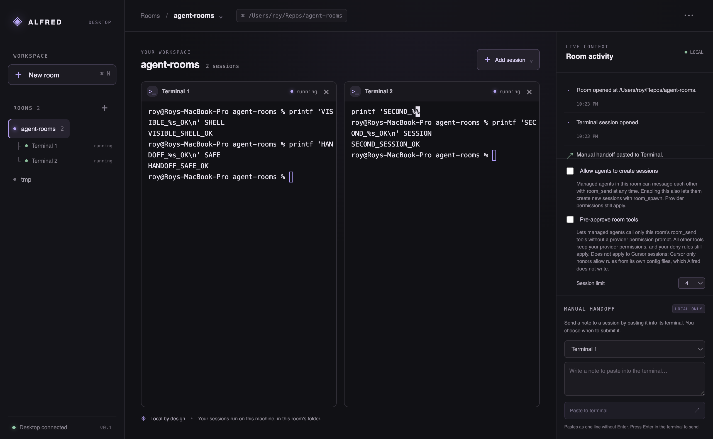

# Alfred

Alfred is a Mac-first desktop workspace for working with coding agents in focused project rooms. It brings vertical tabs, room grouping, and multiple local agent sessions into one calm, inspectable interface while continuing to use the CLIs developers already have installed.

The project is licensed under Apache-2.0. Publishing the repository (making it public, cutting a GitHub release) still requires explicit owner approval.

## Current state

This is an early MVP in active development. The current implementation uses Electron 44.4.4 and Vite 8.3.0. The first build is focused on a real local shell/PTY foundation, then detected Claude Code/Codex CLI sessions, split terminal panes, local room metadata, and a Room Activity view. In this stage, users copy or paste a handoff, inspect it, and explicitly submit it. Future agent dispatch may be authorized by a room-level policy; the MVP does not implement that yet.

Agent dispatch, automatic context transfer, and cross-provider delegation are future work. The current MVP does not claim that a native delegation redirect is supported. See [the product brief](doc/product.md) and [the roadmap](doc/roadmap.md) for boundaries and status.

## Get started

Requirements: macOS, Node.js 22.12+ (or a current newer release), and npm. Claude Code or Codex is optional; the shell demo can be used without either.

```sh
npm install
npm run dev
```

Open a room and start a shell session to confirm PTY input and output. If a supported CLI is installed and detected, start it from the same session controls. For a handoff, use the visible copy/paste flow, review the receiving prompt, and submit it yourself. Do not assume the app can transfer hidden context between providers.

Project checks:

```sh
npm test
npm run build
npm run test:smoke
```

`test:smoke` has passed against the actual Electron app and two local shells. It verifies terminal I/O, manual paste without submission, room switching/removal and metadata restoration after restart. It uses temporary app state and does not launch billable agent work. Five backend tests and the production build also pass. See [the task tracker](doc/tasks.md) for remaining work.

Run the production build with `npm run build && npm start`. This is a source checkout, not yet a signed installer.



## Documentation

- [Product brief](doc/product.md)
- [Architecture](doc/architecture.md)
- [Roadmap](doc/roadmap.md)
- [Task tracker](doc/tasks.md)
- [Agent adapters](doc/adapters.md)
- [Decision log](doc/decisions.md)

## Project principles

- Keep the local CLI as the agent runtime and preserve existing user authentication.
- Keep agent dispatch explicit, authorized, and observable; the MVP manual-paste path never auto-submits.
- Treat delegation and provider context boundaries honestly.
- Use no orchestration LLM. Alfred is a workspace and harness, not an extra reasoning layer.
